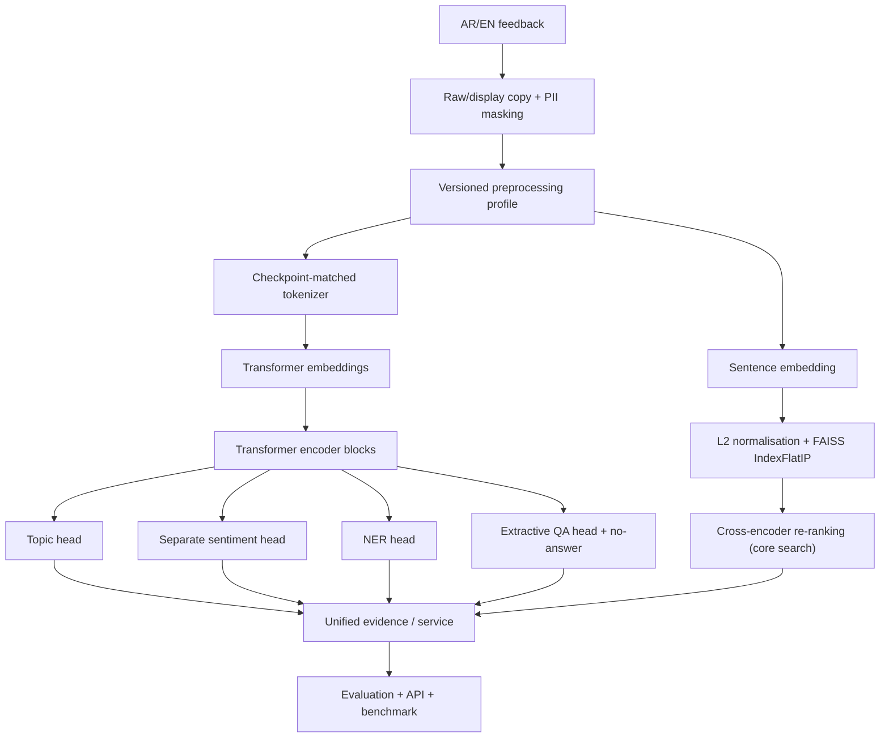

# Bayan — Bilingual Applied NLP Project

**Learner / المتدرب:** Anas Ibrahim Al-Mutairi  
**GitHub:** `Ans212121`  
**Program:** Applied Natural Language Processing with Transformers  
**Program code:** `SDA-AIE-211`  
**Trainer:** Meaad Al-Marri — ميعاد المري

## Executive summary | الملخص

Bayan is an educational bilingual NLP system for Arabic and English feedback. The project covers privacy-aware preprocessing, topic and sentiment classification, NER, extractive QA with no-answer handling, bilingual semantic search, evaluation/error analysis, optimisation and a tested service interface.

The preserved results in this repository come from the student's own Colab run and are labelled honestly as `MEASURED_SMOKE` or `COURSE_FIXTURE`. They are not production claims. A correction cycle is in progress to add the missing separate sentiment evidence, rerun Day 4 on the actual project artefact, and measure a valid R7 extension.

## Problem, scope and non-goals

**Problem.** Convert Arabic/English feedback into a documented NLP response while preserving privacy and producing evidence that can be reproduced.

**In scope.**
- protected preprocessing and PII masking;
- topic and sentiment classification as separate label contracts;
- Named Entity Recognition;
- extractive QA and no-answer logic;
- multilingual embeddings + FAISS + core re-ranking;
- sliced evaluation, confidence intervals and manual error taxonomy;
- PROJECT_ARTIFACT performance benchmarking and service tests;
- one additional measured extension.

**Out of scope.**
- production government deployment;
- decisions about real individuals;
- unreviewed use on sensitive/private data;
- treating smoke/course-fixture results as production estimates.

## Architecture | المعمارية



### Encoder flow

For Transformer tasks, text first passes through the project preprocessing contract, then the tokenizer produces input IDs and attention masks. The embedding layer maps token IDs to vectors. Those vectors pass through stacked Transformer encoder blocks, where self-attention and feed-forward layers update contextual token representations. A task-specific head then consumes the resulting representation: sequence-classification heads for topic/sentiment, token-level outputs for NER, or start/end span scores for extractive QA.

### Attention interpretation boundary

The project validates scaled dot-product attention, masking, multi-head reshaping and NumPy↔PyTorch parity. **Attention weights are descriptive internal weights and are not causal proof of why a prediction was made.** An attention map can show where attention mass was placed, but it does not by itself establish feature importance or causality.

## Reproduce on Google Colab Free

Open the notebooks from **this repository**, save your own copy in Drive, then use **Runtime → Restart session and run all**. The corrected notebooks are derived from the student's actual project work rather than the trainer starter outputs.

| # | Notebook | Open in Colab | Purpose |
|---:|---|---|---|
| 00 | [runtime doctor](notebooks/00_runtime_doctor.ipynb) | [Colab](https://colab.research.google.com/github/Ans212121/Bayan-NLP-Anas-alMutairi/blob/correction-evidence-audit-20260930/notebooks/00_runtime_doctor.ipynb) | environment |
| 01 | [text processing/tokenisation](notebooks/01_text_processing_tokenization.ipynb) | [Colab](https://colab.research.google.com/github/Ans212121/Bayan-NLP-Anas-alMutairi/blob/correction-evidence-audit-20260930/notebooks/01_text_processing_tokenization.ipynb) | Gate A |
| 02 | [attention/transformers](notebooks/02_attention_transformers.ipynb) | [Colab](https://colab.research.google.com/github/Ans212121/Bayan-NLP-Anas-alMutairi/blob/correction-evidence-audit-20260930/notebooks/02_attention_transformers.ipynb) | architecture |
| 03 | [topic + separate sentiment](notebooks/03_text_classification.ipynb) | [Colab](https://colab.research.google.com/github/Ans212121/Bayan-NLP-Anas-alMutairi/blob/correction-evidence-audit-20260930/notebooks/03_text_classification.ipynb) | Gate B |
| 04 | [NER and QA](notebooks/04_ner_and_qa.ipynb) | [Colab](https://colab.research.google.com/github/Ans212121/Bayan-NLP-Anas-alMutairi/blob/correction-evidence-audit-20260930/notebooks/04_ner_and_qa.ipynb) | Gate B |
| 05 | [Arabic NLP](notebooks/05_arabic_nlp.ipynb) | [Colab](https://colab.research.google.com/github/Ans212121/Bayan-NLP-Anas-alMutairi/blob/correction-evidence-audit-20260930/notebooks/05_arabic_nlp.ipynb) | Gate C |
| 06 | [semantic search](notebooks/06_semantic_search.ipynb) | [Colab](https://colab.research.google.com/github/Ans212121/Bayan-NLP-Anas-alMutairi/blob/correction-evidence-audit-20260930/notebooks/06_semantic_search.ipynb) | Gate C |
| 07 | [evaluation/error analysis](notebooks/07_evaluation_error_analysis.ipynb) | [Colab](https://colab.research.google.com/github/Ans212121/Bayan-NLP-Anas-alMutairi/blob/correction-evidence-audit-20260930/notebooks/07_evaluation_error_analysis.ipynb) | Gate C |
| 08 | [optimisation/serving + batch extension](notebooks/08_optimization_serving.ipynb) | [Colab](https://colab.research.google.com/github/Ans212121/Bayan-NLP-Anas-alMutairi/blob/correction-evidence-audit-20260930/notebooks/08_optimization_serving.ipynb) | Gate D / R7 |

Dependencies are pinned by day:
- [requirements-day1.txt](requirements-day1.txt)
- [requirements-day2.txt](requirements-day2.txt)
- [requirements-day3.txt](requirements-day3.txt)
- [requirements-day4.txt](requirements-day4.txt)

## Preserved measured evidence

| Component | Metric | Result + label | Evidence |
|---|---|---:|---|
| topic baseline | test Macro-F1 | **0.7333 — MEASURED_SMOKE** | [observed_classification.json](reports/observed_classification.json) |
| topic Transformer | test Macro-F1 | **0.8667 — MEASURED_SMOKE** | [observed_classification.json](reports/observed_classification.json) |
| topic Transformer | test accuracy | **0.8750 — MEASURED_SMOKE** | [observed_classification.json](reports/observed_classification.json) |
| sentiment | Macro-F1 | **PENDING_CLEAN_RUN** | corrected Notebook 03 will write `reports/observed_sentiment.json` |
| NER | strict entity F1 | **0.5714 — MEASURED_SMOKE** | [observed_ner_qa.json](reports/observed_ner_qa.json) |
| QA | span + no-answer checks | **PASS — COURSE_FIXTURE** | [observed_ner_qa.json](reports/observed_ner_qa.json) |
| search | Recall@3 | **1.0000 — MEASURED_SMOKE** | [search manifest](reports/observed_search_manifest.json) + saved notebook |
| core re-ranking | MRR@3 | **0.6667 → 0.7222** | [observed_reranking_display.json](reports/observed_reranking_display.json) |
| behaviour suite | pass rate | **3/6 = 0.5000 — COURSE_FIXTURE** | [day3_evaluation_fixture.json](reports/day3_evaluation_fixture.json) |

Exact slices and error evidence:
- [day3_slice_report.csv](reports/day3_slice_report.csv)
- [day3_error_taxonomy.csv](reports/day3_error_taxonomy.csv)
- [day3_evaluation_fixture.json](reports/day3_evaluation_fixture.json)

## Error found and decision

The predefined COURSE_FIXTURE annotations (not a review of this trained model) contain:
- `dialect_gap`: **3**
- `hard_or_ambiguous`: **3**
- `class_confusion`: **2**

The weakest recorded fixture slice was `length=long` with Macro-F1 **0.5259**, 95% CI **[0.3918, 0.8308]**. The paired A/B comparison had B−A **+0.0012**, 95% CI **[-0.1047, 0.0996]**, so the fixture does not support a directional superiority claim.

Priority fixes are documented in [EVALUATION_REPORT.md](EVALUATION_REPORT.md) and [DECISIONS.md](DECISIONS.md).

## Day 4 claim boundary

The old Day 4 result is explicitly **SYSTEMS_SMOKE**. It is not the final project benchmark.

Corrected Notebook 08 is prepared to:
1. load the saved Bayan topic model and validation workload;
2. measure PyTorch / ONNX FP32 / dynamic INT8 on the same project examples;
3. record p50/p95/p99, throughput, memory and Macro-F1 quality tax;
4. make an evidence-based ship/rollback decision;
5. write `reports/benchmark_results.json`.

See [BENCHMARKS.md](BENCHMARKS.md).

## Required measured extension

The project now uses **batch endpoint** as the R7 extension. Cross-encoder re-ranking is kept as a core search component and is no longer claimed as the extension.

Corrected Notebook 08 compares sequential single-item calls with a true batch call, checks prediction agreement, and measures latency/throughput trade-off. It will write `reports/extension_batch_endpoint.json` after the clean run.

## Repository structure

```text
.
├── README.md
├── STUDENT_PROFILE.md
├── PROGRESS.md
├── DECISIONS.md
├── BENCHMARKS.md
├── EVALUATION_REPORT.md
├── MODEL_CARD.md
├── DATA_CARD.md
├── PROJECT_SUMMARY.json
├── SUBMISSION.yml
├── PRESENTATION.md
├── notebooks/
│   ├── 00_runtime_doctor.ipynb
│   ├── 01_text_processing_tokenization.ipynb
│   ├── 02_attention_transformers.ipynb
│   ├── 03_text_classification.ipynb
│   ├── 04_ner_and_qa.ipynb
│   ├── 05_arabic_nlp.ipynb
│   ├── 06_semantic_search.ipynb
│   ├── 07_evaluation_error_analysis.ipynb
│   └── 08_optimization_serving.ipynb
├── src/bayan/
├── tests/
├── reports/
├── sample_outputs/
└── requirements-day1.txt ... requirements-day4.txt
```

The root file `bayan_NLP_ANAS_AI_Mutairi (2).ipynb` is retained as provenance for the student's earlier combined Colab run. Final grading evidence should come from the corrected official 00–08 paths after their clean run.

## Final validation workflow

After all nine notebooks are clean-run and saved with outputs:

```bash
PYTHONPATH=src python -m pytest -q tests
PYTHONPATH=src python scripts/validate_submission.py . --json-report reports/submission_validation.json
PYTHONPATH=src python scripts/preflight_submission.py . --report reports/preflight.json
```

After the corrected final tag is created according to the trainer's resubmission instructions:

```bash
PYTHONPATH=src python scripts/validate_submission.py . --require-tag
PYTHONPATH=src python scripts/preflight_submission.py . --require-tag --report reports/preflight.json
```

## Limitations and responsible use

- Course datasets and many slices are small.
- Smoke and course-fixture metrics are not production estimates.
- Gulf dialect and Arabizi coverage is limited.
- NER evidence contains very few entities.
- Runtime latency varies with Colab CPU conditions.
- Real sensitive data must not be added.
- Any real-world/high-impact use requires stronger validation and human review.

## My contribution | مساهمتي

The supplied combined notebook is evidence of my saved Colab execution. [Cell provenance](reports/notebook_provenance.json) maps the extracted sections to original zero-based cells: preprocessing/tokenisation 6–15, attention 16–26, topic classification 27–39, NER/QA 40–57, Arabic 58–69, search 70–83 and evaluation 99–110. [Historical outputs](reports/historical_evidence.txt) preserve the measured evidence. Execution does not imply that all course code was independently authored by me; course code is attributed to Meaad Al-Marri.

The correction code and reorganisation were prepared with AI assistance and are awaiting my fresh execution and review. My understanding and final personal declaration cannot be verified automatically.

## AI assistance | الاستعانة بالأدوات

**ChatGPT / Codex by OpenAI** assisted with comparing the assessment, extracting and mapping my saved cells, correcting documentation, and preparing code for sentiment, artifact export, project evaluation and batch serving. These changes were inspected mechanically; they were not executed as a fresh Colab ML run by the assistant. I must inspect the code, run the corrected notebooks, compare generated reports and explain the decisions before final submission.

## Training context | السياق التدريبي

This educational project was developed during Applied Natural Language Processing
with Transformers (SDA-AIE-211) in the SDAIA Academy training context.

أُنجز هذا المشروع التعليمي ضمن دورة معالجة اللغات الطبيعية باستخدام المحولات
(SDA-AIE-211) في السياق التدريبي لأكاديمية سدايا.

Academy | الأكاديمية: [SDAIA Academy](https://github.com/SDAIAAcademy)  
Trainer | المدربة: Meaad Al-Marri — ميعاد المري  
Course source | مصدر الدورة: https://github.com/almiyead-rgb/bayan-applied-nlp-course  
#SDAIAAcademy

This attribution does not claim Academy endorsement or ownership of third-party assets.

## Correction status

The old `submission-v1.0` release corresponds to the previously assessed version. The corrected release must only be finalised after clean notebook runs, validators and the trainer's allowed resubmission procedure.


## Current blockers and exact rerun instructions

Read [COLAB_RERUN.md](COLAB_RERUN.md) and [assessment repair matrix](reports/assessment_repair_matrix.md). New/changed cells have no fabricated outputs. The original 03 and 08 results remain in the historical evidence report; their changed dependent cells have been cleared.

The actual runtime Git checkout of the old run was not captured. The assessed commit is an archive reference, not an asserted runtime commit. New runs print `RUN_COMMIT` and store it with the new project reports.

The repository still needs the prescribed name `bayan-nlp-Ans212121`. The available GitHub connector does not expose repository rename; this remains a manual account setting. After renaming, update repository URLs/Colab links and the notebook setup URL before fresh runs.

Historical commit timing cannot be repaired by backdating or manufacturing gate completion. Gates remain open until their actual new measurements exist. No corrected final tag has been selected or created.

[Preflight report](reports/preflight.json) is a diagnostic, not a claim of completion. The expected blockers include unexecuted new cells, SYSTEMS_SMOKE benchmark status and the pending final tag.

This correction is isolated on `correction-evidence-audit-20260930` while another session updates main. The Colab links and setup clone this correction branch. After merging, switch both consistently to main.
